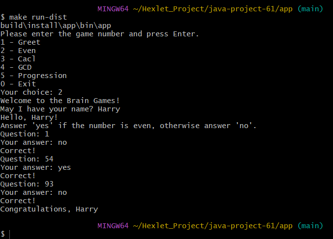
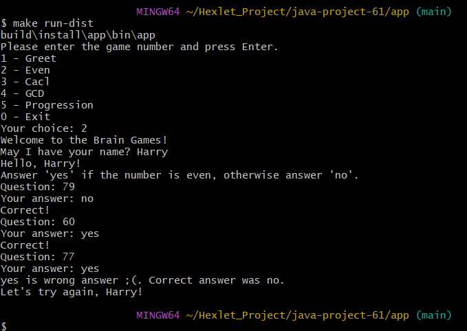
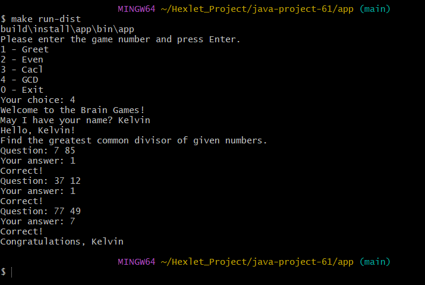
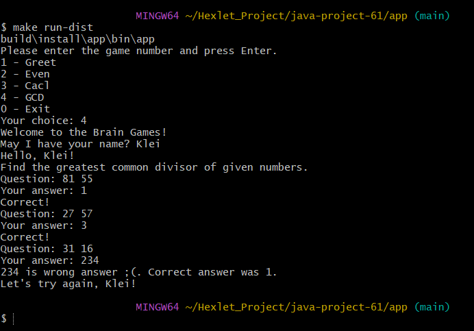
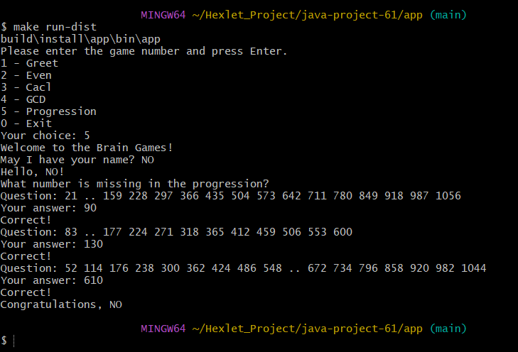
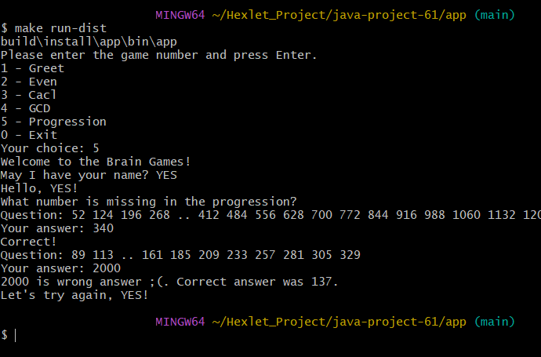
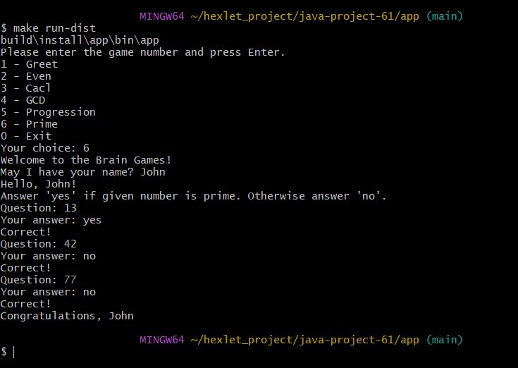
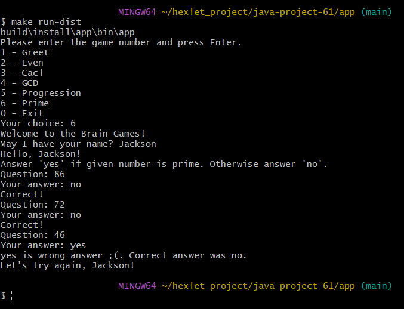
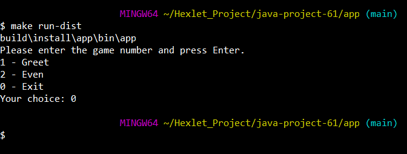

### Hexlet tests and linter status:

### SonarQube

### PMD and Checkstyle

### User's Greeting

### Victory in the app Even 

### Defeat in the app Even 

### Victory in the app Calc 

### Defeat in the app Calc 

### Victory in the app GCD 

### Defeat in the app GCD 

### Victory in the app Progression 

### Defeat in the app Progression 

### Victory in the app Prime 

### Defeat in the app Prime 

### Exiting the app   
